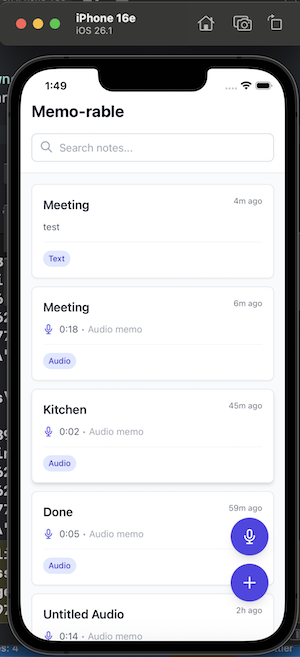

# Memo-rable

A minimal but clean note-taking app for mobile and web.

**Author:** Caleb Tony-Enwin

Memo-rable is a mobile-first Capacitor application built with React, TypeScript, and Vite. It supports both text notes and audio memos, with offline-first behavior and full search capabilities.

## App Preview



The app features a clean, intuitive interface with:

- **Search functionality** at the top for quick note filtering
- **Unified note list** displaying both text and audio memos
- **Note cards** showing title, content preview, type badge, and timestamp
- **Floating action buttons** for quick access to create new notes (text or audio)
- **Mobile-optimized design** with safe area support for modern iOS devices

## Features

- **Text Notes**: Create and edit text notes with titles and bodies
- **Audio Memos**: Record and save audio memos with titles and playback support
- **Unified List View**: View all notes (text + audio) in one chronological list
- **Search**: Client-side filtering by title or body content
- **Offline-First**: All data stored locally using Capacitor Preferences
- **Background Recording**: Audio recording continues when device is locked (native platforms)
- **Cross-Platform**: Works on iOS, Android, and Web

## Tech Stack

- **Framework**: React 18 with TypeScript (strict mode)
- **Build Tool**: Vite
- **Mobile Wrapper**: Capacitor 5
- **UI**: Tailwind CSS (mobile-friendly defaults)
- **State Management**: React Hooks (no Redux)
- **Storage**: Capacitor Preferences API via `useStorage` hook
- **Audio Recording**: `capacitor-voice-recorder` for native platforms, MediaRecorder API for web
- **Audio Playback**: `@capacitor-community/native-audio` for native, HTML5 Audio for web
- **Navigation**: React Router v6
- **Testing**: Vitest + React Testing Library
- **Linting**: ESLint + Prettier

## Project Structure

```
src/
├── __tests__/              # All tests centralized
│   ├── setup.ts            # Test setup and mocks
│   ├── hooks/              # Hook tests
│   │   ├── useNotes.test.ts
│   │   └── useStorage.test.ts
│   ├── lib/                # Library tests
│   │   └── types.test.ts
│   └── utils/              # Utility tests
│       └── id.test.ts
├── components/             # React UI components only
│   ├── audio/
│   │   └── AudioPlayerUI.tsx
│   ├── note/
│   │   ├── NoteCard.tsx        # Note preview card for list view
│   │   ├── NoteViewHeader.tsx  # Note view header with edit controls
│   │   └── NoteViewContent.tsx # Note content display (text/audio)
│   ├── recorder/
│   │   ├── AudioPreview.tsx
│   │   └── RecordingControls.tsx
│   ├── AudioPlayer.tsx     # Main audio player component
│   ├── Recorder.tsx        # Main recorder component
│   └── SplashScreen.tsx
├── hooks/                  # All custom React hooks centralized
│   ├── useAudioPlayer.ts   # Audio playback logic
│   ├── useAudioUrlLoader.ts # Audio URL loading from filesystem
│   ├── useNotes.ts         # Note management (CRUD, search)
│   ├── useRecorder.ts      # Audio recording functionality
│   └── useStorage.ts       # Storage operations hook
├── pages/                  # Page components (routes)
│   ├── Home.tsx            # Main list view with search
│   ├── NoteView.tsx        # Single note view/editor (orchestrates components)
│   └── NewNote.tsx         # Create new note (text or audio)
├── lib/                    # Core type definitions
│   └── types.ts            # TypeScript type definitions
└── utils/                  # All utilities centralized
    ├── id.ts               # ID generation utilities
    └── audio/              # Audio-related utilities
        ├── audioUtils.ts           # Formatting, waveform generation
        ├── audioUrlLoader.ts      # Audio URL creation from base64
        ├── formatUtils.ts         # Duration formatting
        ├── html5AudioLoader.ts    # Web platform audio loading
        └── nativeAudioLoader.ts   # Native platform audio loading
```

## Getting Started

### Prerequisites

- Node.js 18+ and npm
- For mobile development:
  - **iOS**: Xcode 14+ with iOS 13+ SDK
  - **Android**: Android Studio with Android SDK 22+

### Installation

1. Install dependencies:

```bash
npm install
```

2. Start the development server:

```bash
npm run dev
```

The app will be available at `http://localhost:5173`

3. Build for production:

```bash
npm run build
```

### Mobile Development

#### iOS

1. Build and sync with Capacitor:

```bash
npm run cap:ios
```

This will:

- Build the web app
- Sync to iOS project
- Open Xcode

2. In Xcode, select your target device/simulator and run the app.

3. For live reload during development:

```bash
# Get your local IP address
npm run ip

# Update capacitor.config.ts with the IP
# Then run:
npm run dev:ios
```

#### Android

1. Build and sync with Capacitor:

```bash
npm run cap:android
```

This will:

- Build the web app
- Sync to Android project
- Open Android Studio

2. In Android Studio, select your target device/emulator and run the app.

## Development

### Code Quality

Run linting:

```bash
npm run lint
```

Format code:

```bash
npm run format
```

Check formatting:

```bash
npm run format:check
```

### Testing

Run tests:

```bash
npm test
```

Run tests with UI:

```bash
npm run test:ui
```

Run tests with coverage:

```bash
npm run test:coverage
```

### Test Coverage

The project includes tests for:

- Storage hook (`useStorage`) - load/save operations
- Notes hook (`useNotes`) - CRUD and search operations
- ID generation utilities
- Type definitions

## Architecture & Trade-offs

### Code Organization

**Centralized Structure:**

- **Hooks**: All custom hooks in `src/hooks/`
- **Utils**: All utility functions in `src/utils/`
- **Tests**: All tests in `src/__tests__/` organized by feature area
- **Components**: UI components only, no business logic

**Benefits:**

- Easy to find and reuse code
- Clear separation of concerns
- Consistent import paths
- Easier to maintain and test

### Storage Strategy

**Current**: Capacitor Preferences API via `useStorage` hook

**Pros**:

- Simple API
- Works across all platforms
- No additional dependencies
- Storage operations provided as React hooks

**Cons**:

- Limited query capabilities
- All notes loaded into memory
- Performance may degrade with very large datasets (1000+ notes)

**Future Considerations**:

- Migrate to SQLite for better performance with large datasets
- Add pagination for note lists
- Implement incremental loading

### Audio Recording

**Native Platforms** (iOS/Android):

- Uses `capacitor-voice-recorder` plugin
- Supports background recording
- Audio saved as M4A files

**Web Platform**:

- Falls back to MediaRecorder API
- Limited browser support
- Audio saved as WebM/MP4 files

**Trade-offs**:

- Different audio formats across platforms
- Web platform has limited background recording support
- File paths differ between native and web

### Audio Playback

**Native Platforms**:

- Uses `@capacitor-community/native-audio` plugin
- Reliable playback on iOS/Android
- Supports pause/resume

**Web Platform**:

- Uses HTML5 Audio API
- Handles blob URLs and data URLs
- Error handling for false-positive errors

### State Management

**Current**: React Hooks (no Redux)

**Rationale**:

- Simpler for small to medium apps
- Less boilerplate
- Easier to understand and maintain
- No external dependencies

**Future Considerations**:

- If app grows, consider Zustand or Jotai for global state
- Add React Query for async state management if adding API calls

### UI Framework

**Current**: Tailwind CSS (no Ionic React components)

**Rationale**:

- More flexible styling
- Smaller bundle size
- Better performance
- Easier to customize

**Note**: Ionic React was considered but has dependency conflicts with React Router v6. The app uses mobile-friendly Tailwind utilities and safe area insets for iOS.

## Development Tips

### Audio File Paths

Audio files are stored in Capacitor's Data directory:

- **Native**: `file://` URLs pointing to app's data directory
- **Web**: Data URLs (base64 encoded) or blob URLs

When loading audio for playback, the app handles both formats automatically through platform-specific loaders.

### Background Recording

Background recording is enabled via Capacitor config:

- iOS: Requires `UIBackgroundModes` with `audio` in `Info.plist` (handled by plugin)
- Android: Handled by the voice recorder plugin

### Safe Area Support

The app includes safe area utilities for iOS devices with notches:

- `.pt-safe` - Top safe area padding
- `.pb-safe` - Bottom safe area padding
- Defined in `src/index.css`

### Import Paths

- **Hooks**: `import { useNotes } from '../hooks/useNotes'`
- **Utils**: `import { generateId } from '../utils/id'`
- **Components**: `import { AudioPlayer } from '../components/AudioPlayer'`

## Known Limitations

1. **Audio Format**: Different formats on different platforms (M4A on native, WebM/MP4 on web)
2. **iOS Audio Playback**: Uses `@capacitor-community/native-audio` plugin for reliable playback on iOS. HTML5 audio has limitations on iOS Safari WebView, so native audio is used instead.
3. **Search**: Currently only searches text notes (not audio note titles)
4. **No pagination**: All notes loaded at once (fine for small datasets)
5. **Large Datasets**: All notes loaded into memory (may be slow with 1000+ notes)
6. **No Cloud Sync**: All data is local-only
7. **No Rich Text**: Text notes are plain text only
8. **Web Audio**: Limited browser support for MediaRecorder API

## Future Enhancements

- [ ] Note editing (currently only text notes can be edited after creation)
- [ ] Note categories/tags
- [ ] Export notes (JSON, PDF, etc.)
- [ ] Cloud sync (Firebase, iCloud, etc.)
- [ ] Rich text editing for text notes
- [ ] Audio transcription for voice memos
- [ ] Dark mode
- [ ] Note sharing
- [ ] SQLite migration for better performance
- [ ] Pagination for large note lists

## Contributing

See [CONTRIBUTING.md](./CONTRIBUTING.md) for development guidelines and code style.

## License

MIT
